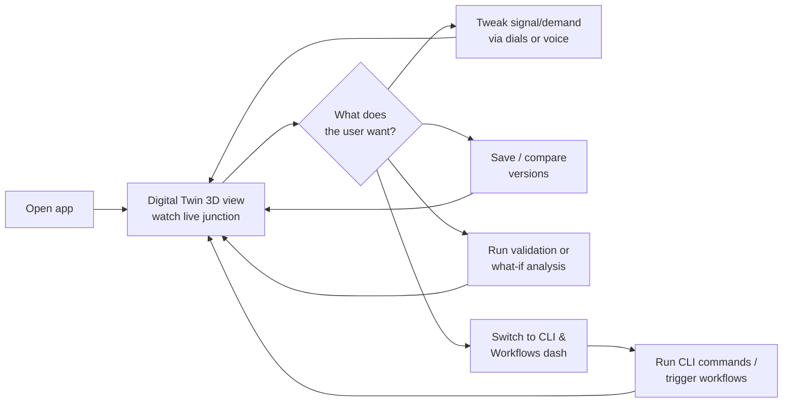

# Abhyas — User Flow

## Notes

- **One home base**: the 3D Digital Twin view, always live.
- From there the user branches into four things: adjust the sim, manage versions, run analysis jobs, or hop to the CLI/Workflows dash — then comes back.
